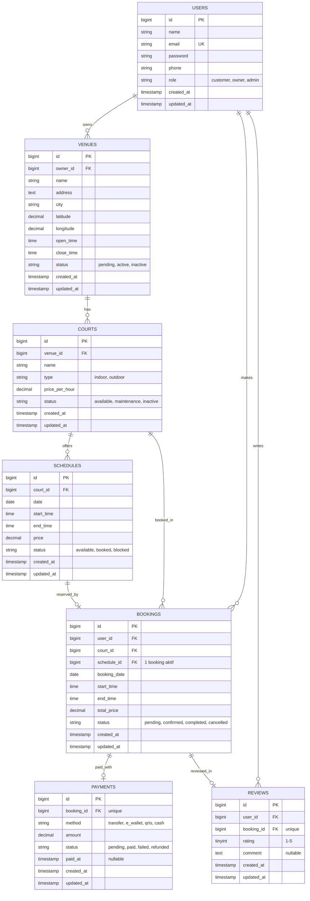

# P01 - Database Design: Padel Courtside

**Marketplace Lapangan Padel Multi-Owner**

**Nama Aplikasi:** Padel Courtside  
**Deskripsi:** Platform marketplace pencarian dan pemesanan lapangan padel dari banyak venue (multi-owner), mencakup pencarian lapangan, pemilihan jadwal, booking, pembayaran, dan review.

---

## 1. Deskripsi Sistem

**Padel Courtside** adalah platform *marketplace* (perantara) untuk pencarian dan pemesanan lapangan padel dari berbagai pemilik atau venue. Satu aplikasi dapat menampung banyak venue sekaligus, misalnya "Padel Yeori" dan "Eunbining Padel". Pengguna umum dapat mencari lapangan, melihat venue tersebut milik siapa, memilih jadwal yang tersedia, lalu melakukan pemesanan dan pembayaran dalam satu platform.

Sistem ini memiliki tiga aktor utama yang seluruhnya disimpan dalam tabel `users` dan dibedakan melalui kolom `role`:

- **Customer**: pengguna umum yang mencari lapangan, memesan jadwal, membayar, dan memberikan ulasan.
- **Owner Venue**: pemilik venue yang mengelola data venue, lapangan, dan jadwal, serta memantau pemesanan yang masuk.
- **Admin**: pengelola platform yang memverifikasi venue, mengawasi transaksi, dan menjaga kualitas data.

Alur utama sistem adalah **cari lapangan → pilih jadwal → booking → bayar → review**. Customer mencari venue berdasarkan kota atau lokasi, memilih lapangan beserta jadwal kosong, membuat pemesanan, menyelesaikan pembayaran, dan setelah bermain dapat memberikan penilaian terhadap pemesanan tersebut.

---

## 2. Daftar Entitas dan Atribut

### 2.1 USERS

Menyimpan data seluruh pengguna (customer, owner venue, dan admin).

| Atribut      | Tipe Data                        | Keterangan              |
| ------------ | -------------------------------- | ----------------------- |
| `id`         | BIGINT (PK, auto increment)      | Identitas unik pengguna |
| `name`       | VARCHAR(100)                     | Nama lengkap            |
| `email`      | VARCHAR(150) (UNIQUE)            | Email untuk login       |
| `password`   | VARCHAR(255)                     | Kata sandi (ter-*hash*) |
| `phone`      | VARCHAR(20)                      | Nomor telepon           |
| `role`       | ENUM('customer','owner','admin') | Peran pengguna          |
| `created_at` | TIMESTAMP                        | Waktu data dibuat       |
| `updated_at` | TIMESTAMP                        | Waktu data diperbarui   |

### 2.2 VENUES

Menyimpan data tempat/venue padel milik owner.

| Atribut      | Tipe Data                           | Keterangan            |
| ------------ | ----------------------------------- | --------------------- |
| `id`         | BIGINT (PK, auto increment)         | Identitas unik venue  |
| `owner_id`   | BIGINT (FK → users.id)              | Pemilik venue         |
| `name`       | VARCHAR(150)                        | Nama venue            |
| `address`    | TEXT                                | Alamat lengkap        |
| `city`       | VARCHAR(100)                        | Kota                  |
| `latitude`   | DECIMAL(10,7)                       | Koordinat lintang     |
| `longitude`  | DECIMAL(10,7)                       | Koordinat bujur       |
| `open_time`  | TIME                                | Jam buka              |
| `close_time` | TIME                                | Jam tutup             |
| `status`     | ENUM('pending','active','inactive') | Status venue          |
| `created_at` | TIMESTAMP                           | Waktu data dibuat     |
| `updated_at` | TIMESTAMP                           | Waktu data diperbarui |

### 2.3 COURTS

Menyimpan data lapangan yang berada di dalam sebuah venue.

| Atribut          | Tipe Data                                  | Keterangan                   |
| ---------------- | ------------------------------------------ | ---------------------------- |
| `id`             | BIGINT (PK, auto increment)                | Identitas unik lapangan      |
| `venue_id`       | BIGINT (FK → venues.id)                    | Venue pemilik lapangan       |
| `name`           | VARCHAR(100)                               | Nama lapangan (mis. Court A) |
| `type`           | ENUM('indoor','outdoor')                   | Jenis lapangan               |
| `price_per_hour` | DECIMAL(12,2)                              | Harga dasar per jam          |
| `status`         | ENUM('available','maintenance','inactive') | Status lapangan              |
| `created_at`     | TIMESTAMP                                  | Waktu data dibuat            |
| `updated_at`     | TIMESTAMP                                  | Waktu data diperbarui        |

### 2.4 SCHEDULES

Menyimpan slot jadwal yang dapat dipesan pada sebuah lapangan.

| Atribut      | Tipe Data                            | Keterangan                        |
| ------------ | ------------------------------------ | --------------------------------- |
| `id`         | BIGINT (PK, auto increment)          | Identitas unik jadwal             |
| `court_id`   | BIGINT (FK → courts.id)              | Lapangan yang dijadwalkan         |
| `date`       | DATE                                 | Tanggal slot                      |
| `start_time` | TIME                                 | Jam mulai                         |
| `end_time`   | TIME                                 | Jam selesai                       |
| `price`      | DECIMAL(12,2)                        | Harga slot (bisa berbeda per jam) |
| `status`     | ENUM('available','booked','blocked') | Status slot                       |
| `created_at` | TIMESTAMP                            | Waktu data dibuat                 |
| `updated_at` | TIMESTAMP                            | Waktu data diperbarui             |

### 2.5 BOOKINGS

Menyimpan data pemesanan lapangan oleh customer.

| Atribut        | Tipe Data                                           | Keterangan               |
| -------------- | --------------------------------------------------- | ------------------------ |
| `id`           | BIGINT (PK, auto increment)                         | Identitas unik pemesanan |
| `user_id`      | BIGINT (FK → users.id)                              | Customer yang memesan    |
| `court_id`     | BIGINT (FK → courts.id)                             | Lapangan yang dipesan    |
| `schedule_id`  | BIGINT (FK → schedules.id)                          | Slot jadwal yang dipesan |
| `booking_date` | DATE                                                | Tanggal bermain          |
| `start_time`   | TIME                                                | Jam mulai bermain        |
| `end_time`     | TIME                                                | Jam selesai bermain      |
| `total_price`  | DECIMAL(12,2)                                       | Total biaya pemesanan    |
| `status`       | ENUM('pending','confirmed','completed','cancelled') | Status pemesanan         |
| `created_at`   | TIMESTAMP                                           | Waktu data dibuat        |
| `updated_at`   | TIMESTAMP                                           | Waktu data diperbarui    |

### 2.6 PAYMENTS

Menyimpan data pembayaran atas sebuah pemesanan.

| Atribut      | Tipe Data                                  | Keterangan                |
| ------------ | ------------------------------------------ | ------------------------- |
| `id`         | BIGINT (PK, auto increment)                | Identitas unik pembayaran |
| `booking_id` | BIGINT (FK → bookings.id, UNIQUE)          | Pemesanan yang dibayar    |
| `method`     | ENUM('transfer','e_wallet','qris','cash')  | Metode pembayaran         |
| `amount`     | DECIMAL(12,2)                              | Jumlah yang dibayar       |
| `status`     | ENUM('pending','paid','failed','refunded') | Status pembayaran         |
| `paid_at`    | TIMESTAMP (NULLABLE)                       | Waktu pembayaran berhasil |
| `created_at` | TIMESTAMP                                  | Waktu data dibuat         |
| `updated_at` | TIMESTAMP                                  | Waktu data diperbarui     |

### 2.7 REVIEWS

Menyimpan ulasan customer terhadap pemesanan yang telah selesai.

| Atribut      | Tipe Data                         | Keterangan                   |
| ------------ | --------------------------------- | ---------------------------- |
| `id`         | BIGINT (PK, auto increment)       | Identitas unik ulasan        |
| `user_id`    | BIGINT (FK → users.id)            | Customer yang memberi ulasan |
| `booking_id` | BIGINT (FK → bookings.id, UNIQUE) | Pemesanan yang diulas        |
| `rating`     | TINYINT                           | Nilai 1 sampai 5             |
| `comment`    | TEXT (NULLABLE)                   | Komentar ulasan              |
| `created_at` | TIMESTAMP                         | Waktu data dibuat            |
| `updated_at` | TIMESTAMP                         | Waktu data diperbarui        |

---

## 3. Entity Relationship Diagram

---

## 4. Relationship Summary

| Dari      | Ke        | Tipe Relasi | Eloquent                | Keterangan                                                     |
| --------- | --------- | ----------- | ----------------------- | -------------------------------------------------------------- |
| USERS     | VENUES    | 1 — N       | `hasMany` / `belongsTo` | Satu owner bisa punya banyak venue                             |
| VENUES    | COURTS    | 1 — N       | `hasMany` / `belongsTo` | Satu venue memiliki banyak lapangan                            |
| COURTS    | SCHEDULES | 1 — N       | `hasMany` / `belongsTo` | Satu lapangan memiliki banyak slot jadwal                      |
| USERS     | BOOKINGS  | 1 — N       | `hasMany` / `belongsTo` | Satu customer dapat membuat banyak pemesanan                   |
| COURTS    | BOOKINGS  | 1 — N       | `hasMany` / `belongsTo` | Satu lapangan dapat dipesan berkali-kali pada waktu berbeda    |
| SCHEDULES | BOOKINGS  | 1 — 1       | `hasOne` / `belongsTo`  | Satu slot jadwal hanya dapat dipesan oleh satu pemesanan aktif |
| BOOKINGS  | PAYMENTS  | 1 — 1       | `hasOne` / `belongsTo`  | Satu pemesanan memiliki satu pembayaran                        |
| BOOKINGS  | REVIEWS   | 1 — 1       | `hasOne` / `belongsTo`  | Satu pemesanan hanya dapat diulas satu kali                    |
| USERS     | REVIEWS   | 1 — N       | `hasMany` / `belongsTo` | Satu customer dapat menulis banyak ulasan                      |
| USERS     | COURTS    | 1 — N (melalui VENUES)   | `hasManyThrough` | Satu owner memiliki banyak lapangan melalui venue-nya    |
| VENUES    | BOOKINGS  | 1 — N (melalui COURTS)   | `hasManyThrough` | Satu venue memiliki banyak pemesanan melalui lapangannya |

---

## 5. Penjelasan Relasi

1. **USERS → VENUES (1 — N)**: Seorang pengguna dengan peran `owner` dapat mendaftarkan banyak venue. Setiap venue hanya memiliki satu pemilik melalui `owner_id`.
2. **VENUES → COURTS (1 — N)**: Sebuah venue dapat memiliki beberapa lapangan, misalnya Court A dan Court B. Setiap lapangan terhubung ke satu venue melalui `venue_id`.
3. **COURTS → SCHEDULES (1 — N)**: Setiap lapangan memiliki banyak slot jadwal pada tanggal dan jam yang berbeda. Tiap slot hanya milik satu lapangan melalui `court_id`.
4. **USERS → BOOKINGS (1 — N)**: Seorang customer dapat membuat banyak pemesanan dari waktu ke waktu. Setiap pemesanan tercatat atas satu customer melalui `user_id`.
5. **COURTS → BOOKINGS (1 — N)**: Sebuah lapangan dapat dipesan berkali-kali pada jadwal yang berbeda. Relasi ini mempermudah pelaporan pemesanan per lapangan.
6. **SCHEDULES → BOOKINGS (1 — 1)**: Satu slot jadwal hanya boleh dipesan satu kali agar tidak terjadi pemesanan ganda. Jadwal yang belum dipesan tidak memiliki data booking (opsional di sisi booking).
7. **BOOKINGS → PAYMENTS (1 — 1)**: Setiap pemesanan memiliki satu catatan pembayaran. Pembayaran yang belum dilakukan berstatus `pending`.
8. **BOOKINGS → REVIEWS (1 — 1)**: Customer hanya dapat memberi satu ulasan untuk setiap pemesanan, dan idealnya setelah status booking `completed`. Kolom `booking_id` bersifat `UNIQUE`.
9. **USERS → REVIEWS (1 — N)**: Seorang customer dapat menulis banyak ulasan dari pemesanan yang berbeda. Setiap ulasan terhubung ke penulisnya melalui `user_id`.
10. **USERS → COURTS (melalui VENUES)**: Owner dapat mengakses seluruh lapangan miliknya lewat venue yang ia daftarkan, tanpa kolom `owner_id` di tabel `courts`. Diimplementasikan dengan `hasManyThrough`.
11. **VENUES → BOOKINGS (melalui COURTS)**: Owner dapat melihat semua pemesanan pada sebuah venue lewat lapangan-lapangannya. Diimplementasikan dengan `hasManyThrough`.

---

## 6. Data Awal (Seeded)

Berikut adalah contoh data awal yang akan di-*seed* ke dalam database untuk memudahkan pengujian alur pencarian dan pemesanan.

**Pengguna**

| No | Nama               | Email                   | Role     | Deskripsi                        |
| -- | ------------------ | ----------------------- | -------- | -------------------------------- |
| 1  | Admin Courtside    | admin@padelcourtside.test | admin    | Pengelola platform               |
| 2  | Owner Padel Yeori  | yeori@padelcourtside.test | owner    | Pemilik venue "Padel Yeori"      |
| 3  | Owner Eunbining    | eunbining@padelcourtside.test | owner | Pemilik venue "Eunbining Padel"  |
| 4  | Customer Contoh    | customer@padelcourtside.test | customer | Pengguna umum untuk pengujian |

**Venue dan Lapangan**

| No | Venue            | Lapangan | Tipe    | Status    |
| -- | ---------------- | -------- | ------- | --------- |
| 1  | Padel Yeori      | Court A  | indoor  | available |
| 2  | Padel Yeori      | Court B  | indoor  | available |
| 3  | Eunbining Padel  | Court 1  | outdoor | available |

---

## 7. Design Notes

- **Multi-owner:** Pemisahan `users` (role `owner`) dan `venues` memungkinkan satu platform menampung banyak venue dengan pemilik berbeda.
- **Modularitas:** Tabel dikelompokkan menjadi 3 pilar utama: Pengguna (`users`), Inventori (`venues`, `courts`, `schedules`), dan Transaksi (`bookings`, `payments`, `reviews`).
- **Skalabilitas:** Tabel `users` dipakai bersama oleh customer, owner, dan admin, sehingga aplikasi mendukung banyak pengguna dan banyak venue tanpa tabel tambahan.
- **Fleksibilitas:** Kolom `role`, `type`, dan `status` memungkinkan berbagai jenis data tanpa perlu membuat tabel baru. Harga juga fleksibel: `courts.price_per_hour` menjadi harga dasar, sedangkan `schedules.price` memungkinkan harga berbeda untuk jam sibuk atau akhir pekan.
- **Normalisasi:** Tabel `courts` tidak menyimpan `owner_id` secara langsung, melainkan terhubung melalui `venue_id` untuk menghindari redundansi data.
- **Redundansi terkontrol:** Kolom `court_id`, `booking_date`, `start_time`, dan `end_time` pada `bookings` menyimpan salinan informasi jadwal agar riwayat pemesanan tetap utuh meskipun jadwal diubah. Nilainya diisi dari `schedule_id` saat booking dibuat.
- **Unique constraints:** `users.email`, `payments.booking_id`, dan `reviews.booking_id`, sehingga satu pemesanan hanya memiliki satu pembayaran dan satu ulasan. Pasangan (`schedules.court_id`, `schedules.date`, `schedules.start_time`) juga unik agar tidak ada slot ganda pada lapangan yang sama.
- **Pencegahan booking ganda:** Kolom `schedule_id` pada `bookings` hanya boleh dipakai oleh satu booking yang berstatus aktif. Jika booking dibatalkan, status jadwal kembali menjadi `available`.
- **Cascade rules:** Menghapus venue ikut menghapus lapangan dan jadwalnya, serta menghapus pemesanan ikut menghapus pembayaran dan ulasannya. Penghapusan lapangan, jadwal, atau pengguna dibatasi (*restrict*) selama masih ada pemesanan, agar riwayat transaksi tidak hilang.
- **Perhitungan:** Rata-rata rating venue dan total pendapatan owner dihitung di level aplikasi dari tabel `reviews` dan `payments`, bukan disimpan sebagai kolom terpisah.

---

## 8. Progress

| | |
|---|---|
| **Status** | 🚧 In progress |
| **Started** | 2026-10-06 |
| **Completed** | - |
| **Branch** | `feature/database-design` |
| **Pull request** | https://github.com/mirzayogy/laravel5d/pull/23 |

### Goal

Design the Padel Courtside database structure (entities, attributes, relationships, and ERD) as the foundation for the Laravel migrations and models in the next phase.

### Jobs

| Code | Job                                   | Status         | Completed  | Proof |
| ---- | ------------------------------------- | -------------- | ---------- | ----- |
| J1   | System description                    | ✅ Done        | 2026-10-06 | [Section 1](https://github.com/Edo-Muhammad/laravel5c/blob/feature/database-design/docs/progress/P01-database-design.md) |
| J2   | Entities and attributes               | ✅ Done        | 2026-10-06 | [Section 2](https://github.com/Edo-Muhammad/laravel5c/blob/feature/database-design/docs/progress/P01-database-design.md) |
| J3   | Entity Relationship Diagram (Mermaid) | ✅ Done        | 2026-10-06 | [Section 3](https://github.com/Edo-Muhammad/laravel5c/blob/feature/database-design/docs/progress/P01-database-design.md) |
| J4   | Relationship summary and explanations | ✅ Done        | 2026-10-06 | [Sections 4-5](https://github.com/Edo-Muhammad/laravel5c/blob/feature/database-design/docs/progress/P01-database-design.md) |
| J5   | Seeded data and design notes          | ✅ Done        | 2026-10-06 | [Sections 6-7](https://github.com/Edo-Muhammad/laravel5c/blob/feature/database-design/docs/progress/P01-database-design.md) |
| J6   | Laravel migrations and models         | ⏳ Planned     | -          | -     |

---

### J1: System description
- **Status:** ✅ Done, 2026-10-06
- **What:** Described Padel Courtside, its three actors (customer, venue owner, admin), and the main flow: search courts → choose schedule → booking → payment → review.
- **Proof:** Section 1 of this file.
- **Verified:** Content matches the assignment brief (2-3 paragraphs).
- **Not done:** -

### J2: Entities and attributes
- **Status:** ✅ Done, 2026-10-06
- **What:** Defined 7 entities (USERS, VENUES, COURTS, SCHEDULES, BOOKINGS, PAYMENTS, REVIEWS) with their attributes and data types.
- **Proof:** Section 2 of this file.
- **Verified:** All required attributes are listed, including `timestamps`.
- **Not done:** -

### J3: Entity Relationship Diagram (Mermaid)
- **Status:** ✅ Done, 2026-10-06
- **What:** Created the Mermaid `erDiagram` with attributes, PK, FK, and UK.
- **Proof:** Section 3 of this file.
- **Verified:** Diagram renders in the GitHub preview (check after `push`).
- **Not done:** -

### J4: Relationship summary and explanations
- **Status:** ✅ Done, 2026-10-06
- **What:** Listed 11 relationships (9 direct and 2 through an intermediate table) with relationship type, Eloquent method, and a short explanation for each.
- **Proof:** Sections 4 and 5 of this file.
- **Verified:** Every foreign key has a matching relationship, and the number of explanations equals the number of relationships.
- **Not done:** -

### J5: Seeded data and design notes
- **Status:** ✅ Done, 2026-10-06
- **What:** Added sample seed data (users, venues, courts) and design notes (unique constraints, cascade rules, normalization).
- **Proof:** Sections 6 and 7 of this file.
- **Verified:** Seed data matches the entity definitions.
- **Not done:** -

### J6: Laravel migrations and models
- **Status:** ⏳ Planned
- **What:** Create migration files and Eloquent models based on this design.
- **Not done:** Not started yet.

## Next

`P02`: create the migrations, models, and Eloquent relationships based on the ERD in this document.
